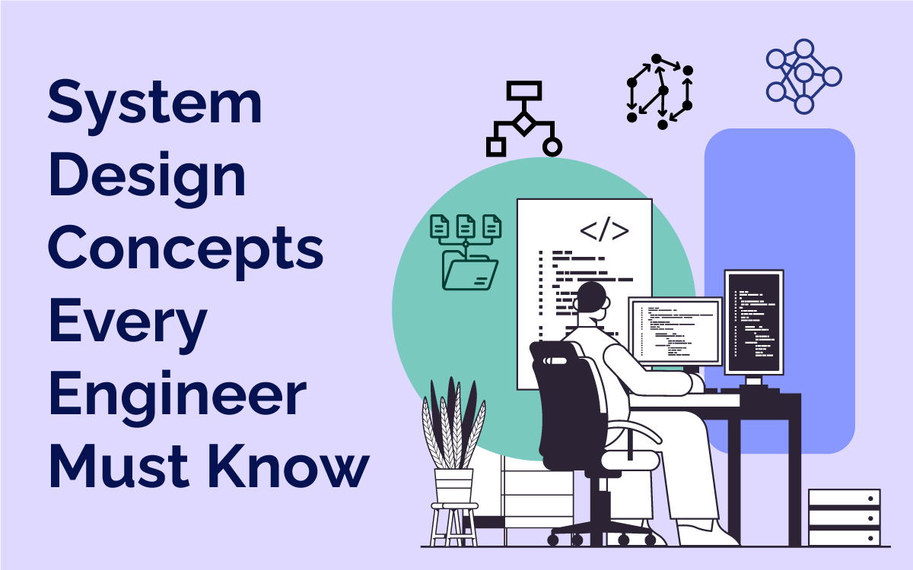

# 🚀 30 Days System Design Marathon

> 📍 Goal: Master System Design  
> 📍 Author: Jeevan  

---

## 🧠 What is System Design?

System Design is the process of designing scalable, reliable, and efficient systems.

It involves:
- Architecture Design
- Networking
- Databases
- APIs
- Scalability
- Performance Optimization

---

## 🏗️ System Design Overview

---

## 🎯 System Design Concepts Every Engineers Must Know

| Day | Topic | Notes |
|-----|------|------|
| Day 1 | Client–Server Architecture | [View](./Day1) |
| Day 2 | HTTP / HTTPS Internals | [View](./Day2) | 
| Day 3 | DNS Resolution Process | [View](./Day3) | 
| Day 4 | API Design (REST vs GraphQL vs gRPC) | [View](./Day4) | 

---

